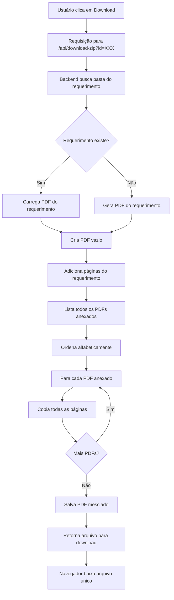

# 📄 Documentação - Implementação de Mesclagem de PDFs

## 🎯 Objetivo
Substituir o sistema de download de arquivos em formato ZIP por um sistema que mescla todos os documentos anexados em um único arquivo PDF, mantendo a ordem correta dos documentos com o requerimento sempre em primeiro lugar.

---

## 📦 Biblioteca Utilizada
- **pdf-lib** (v1.17.1) - Biblioteca JavaScript para criação e manipulação de PDFs
- Instalada via: `npm install pdf-lib`

---

## 🔧 Alterações Realizadas

### 1. **API de Download (app/api/download-zip/route.ts)**
#### Modificações:
- ❌ Removido: `archiver` (criação de ZIPs)
- ❌ Removido: `Readable` do stream
- ✅ Adicionado: `PDFDocument` do `pdf-lib`

#### Lógica Implementada:
1. **Cria um documento PDF vazio** usando `PDFDocument.create()`
2. **Adiciona o requerimento primeiro**:
   - Busca o arquivo `00 - REQUERIMENTO.pdf` na pasta
   - Se não existir, gera dinamicamente usando os dados salvos
3. **Adiciona os demais PDFs anexados**:
   - Filtra apenas arquivos `.pdf` (excluindo `.id`, `.json`, `.txt`)
   - Ordena alfabeticamente
   - Mescla página por página em ordem
4. **Retorna um único PDF** com todos os documentos unidos

#### Resposta da API:
- **Content-Type**: `application/pdf` (antes era `application/zip`)
- **Nome do arquivo**: `Requerimento_Completo_{Nome}.pdf`

---

### 2. **Função de Download (utils/downloadZip.ts)**
#### Modificações:
- Comentários da função `baixarDocumentosZip()` atualizados para refletir que agora baixa um PDF único
- Mensagens de erro atualizadas: "Erro ao mesclar PDFs"
- Nome do arquivo padrão: `Requerimento_Completo_{timestamp}.pdf`

#### Comportamento:
- Função mantém o mesmo nome por compatibilidade
- Interface não mudou - recebe os mesmos parâmetros
- Retorna um arquivo PDF único ao invés de ZIP

---

### 3. **Template de Email (app/api/send-email/route.ts)**
#### Modificações:
- **Texto do botão**: "BAIXAR DOCUMENTOS ANEXADOS (ZIP)" → "BAIXAR REQUERIMENTO COMPLETO (PDF)"
- **Descrição atualizada**: Explica que o botão baixa um PDF único contendo requerimento + anexos

---

## 📋 Ordem dos Documentos no PDF Final

1. **00 - REQUERIMENTO.PDF** (sempre primeiro)
2. **Demais documentos** (ordenados alfabeticamente por nome, sem numeração)

Exemplo de ordem:
```
1. Requerimento (gerado)
2. Alvará
3. Comprovante de Pagamento
4. CPF
5. Estatuto Social
6. Ficha IPTU
7. RG
... (e assim por diante)
```

---

## 🎨 Vantagens da Nova Implementação

### Para o Usuário:
- ✅ **Um único arquivo** ao invés de múltiplos arquivos em um ZIP
- ✅ **Facilita o envio** por email ou upload em sistemas
- ✅ **Ordem garantida** - documentos sempre na sequência correta
- ✅ **Profissional** - arquivo único e organizado

### Para o Sistema:
- ✅ **Mantém compatibilidade** - mesma API endpoint
- ✅ **Menos processamento** - não precisa comprimir/descomprimir
- ✅ **Melhor integração** - PDFs são universalmente aceitos
- ✅ **Escalável** - biblioteca pdf-lib é robusta e bem mantida

---

## 🔄 Fluxo de Funcionamento



---

## 🧪 Como Testar

1. **Acesse um formulário** no sistema
2. **Preencha os dados** e anexe múltiplos PDFs
3. **Submeta o requerimento**
4. **Verifique o email** recebido
5. **Clique em "BAIXAR REQUERIMENTO COMPLETO (PDF)"**
6. **Verifique**:
   - ✅ Arquivo baixado tem extensão `.pdf` (não `.zip`)
   - ✅ Arquivo contém o requerimento na primeira página
   - ✅ Todos os documentos anexados estão presentes
   - ✅ Documentos estão em ordem correta

---

## ⚠️ Observações Importantes

1. **Apenas PDFs são mesclados** - outros formatos de arquivo são ignorados
2. **Arquivos corrompidos** são registrados no log mas não interrompem o processo
3. **Nome do arquivo** é gerado a partir do nome do requerente
4. **Compatibilidade mantida** - a API mantém o mesmo endpoint `/api/download-zip`

---

## 📝 Arquivos Modificados

- ✏️ `app/api/download-zip/route.ts` - Lógica principal de mesclagem
- ✏️ `utils/downloadZip.ts` - Função de download no frontend
- ✏️ `app/api/send-email/route.ts` - Template de email
- ✏️ `package.json` - Adicionada dependência `pdf-lib`

---

## 🚀 Próximos Passos (Opcional)

- [ ] Adicionar índice/sumário no PDF final
- [ ] Adicionar marcadores (bookmarks) para cada documento
- [ ] Adicionar números de página no rodapé
- [ ] Adicionar cabeçalho com logo da prefeitura
- [ ] Implementar compressão do PDF final

---

**Data da Implementação**: 07/01/2026  
**Desenvolvedor**: Daniel Formoso  
**Branch**: `daniel/feature/adicao-biblioteca-juntar-pdfs`
